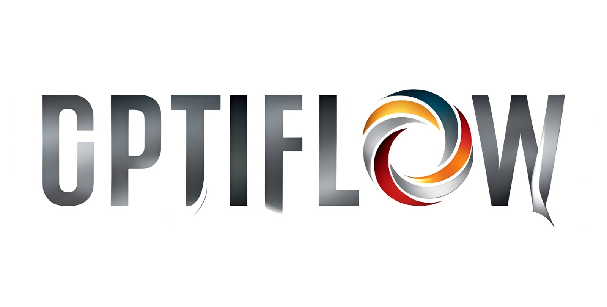

  

<h1 align="center">
    Optimizing Supply Chain orders for storable products under
unified demand  
</h1>

## Challenge

## Evaluation Criteria

## Data
Some information about the given data:

### consumo_material_clean.xlsx
- `CODIGO` *(object)*: Product code (first letter relates to product classification). Unique identifier of a product
- `PRODUCTO` *(object)*: Product description
- `FECHAPEDIDO` *(Date)*: Purchase date (day/month/year) 
- `NUMERO` *(object)*: Order number/year 
- `REFERENCIA` *(object)*: Reference number
- `CANTIDADCOMPRA` *(Numeric)*: Number of products purchased 
- `UNIDADESCONSUMOCONTENIDAS` *(Numeric)*: Number of units that the product contains
- `PRECIO` *(Numeric)*: Cost in €
- `IMPORTELINEA` *(Numeric)*: Total cost of products purchase
- `TIPOCOMPRA` *(object)*: Type of public purchase (Compra menor: minor contract / Concurso : public tender) 
- `ORIGEN` *(object)*: Code corresponding to the purchasing region-hospital-department (anonymized data)
- `TGL` *(object)*: Type of logistic distribution of products (transito: directly delivered at the hospital /almacenable: delivered at purchase center) 

## Other parts of our project